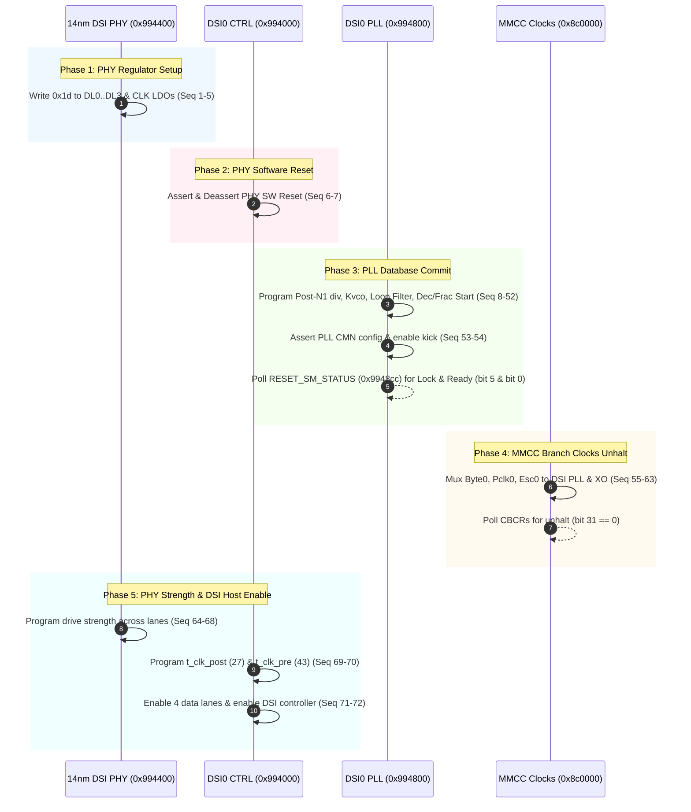

# Linux Golden Display Register Write Trace

## 1. Overview & Derivation
This trace captures the exact sequence of 72 hardware-proven register writes performed during display bring-up on Qualcomm MSM8996 v3 / Sony Xperia XZs (`keyaki`).

- **Hardware State:** Target `BH905SX976`, TWRP 3.18 kernel.
- **Trace Source:** Source disassembly of `mdss_dsi_8996_phy_regulator_enable`, `pll_vco_set_rate_8996`, `pll_db_commit_8996`, `dsi_pll_enable_seq_8996`, `mdss_dsi_clk_ctrl`, and `mdss_dsi_phy_init`, cross-verified with live debugfs MMIO dumps.
- **Total Writes:** 72 ordered operations.

---

## 2. Chronological Subsystem Phases

---

## 3. Summary of Trace Steps

| Step Range | Subsystem | Action |
|---|---|---|
| `0001 - 0005` | DSI PHY | Program LDO bias `0x1d` across 5 lanes (`0x00994564..764`) |
| `0006 - 0007` | DSI CTRL | Assert and clear `DSI_PHY_SW_RESET` (`0x0099412c`) |
| `0008 - 0052` | DSI PLL | Commit VCO dividers, fractional start, calibration tables (`0x00994800..904`) |
| `0053 - 0054` | DSI PLL | Assert output buffer enable and kick clock generator |
| `Status Gate` | DSI PLL | Bounded poll on `0x009948cc` (Mask `0x21` == `0x21`) |
| `0055 - 0063` | MMCC | Select PLL parents and un-halt `mdss_byte0_clk`, `mdss_pclk0_clk`, `mdss_esc0_clk` |
| `0064 - 0068` | DSI PHY | Program lane drive strength (`0x06ff` on data lanes, `0x00ff` on clock lane) |
| `0069 - 0070` | DSI CTRL | Program clock preamble/postamble counters (`t_clk_post=27`, `t_clk_pre=43`) |
| `0071 - 0072` | DSI CTRL | Enable 4 data lanes (`0x009941f4 = 0x03000104`) and enable controller (`0x009940f0 = 0x1`) |
