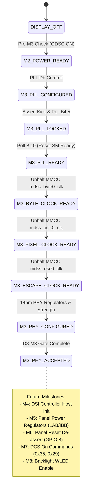

# XNU Dry-Run Display Bring-Up State Machine Design

## 1. Overview & Architectural Boundaries
This document specifies the trace-only / dry-run display bring-up state machine for XNU on Sony Xperia XZs (`keyaki` / MSM8996).

### Strict Safety Rules in Effect (D8-A3 Gate):
- **REAL HARDWARE D8-M3 WRITES = NOT STARTED.**
- **NO DSI PLL/PHY REGISTERS TOUCHED** in hardware.
- **NO ENABLING DSI LANES, DCS COMMANDS, PANEL RESET, OR BACKLIGHT.**
- All MMIO operations during D8-A3 execution run exclusively through the **Trace/Dry-Run Hardware Abstraction Layer (HAL)**.

---

## 2. State Machine Transitions



---

## 3. State Definitions & Acceptance Criteria

| State Name | Prerequisites | Entry Actions (Dry-Run Trace) | Exit Validation |
|---|---|---|---|
| `DISPLAY_OFF` | Cold boot / early kernel | None | Boot args parsed |
| `M2_POWER_READY` | D8-M2 passed | Verify MDSS GDSC status (`0x008c2304` bit 31 == 1) | Checkpoint `D8M3-10` |
| `M3_PLL_CONFIGURED` | M2_POWER_READY | Commit 46 PLL divider & calibration registers | Checkpoint `D8M3-30` |
| `M3_PLL_LOCKED` | M3_PLL_CONFIGURED | Assert common config (`0x10`) & clock kick (`0x01`); Poll `0x009948cc` bit 5 | Checkpoint `D8M3-50` (`val & 0x20 == 0x20`) |
| `M3_PLL_READY` | M3_PLL_LOCKED | Poll `0x009948cc` bit 0 for reset state machine ready | Checkpoint `D8M3-60` (`val & 0x01 == 0x01`) |
| `M3_BYTE_CLOCK_READY` | M3_PLL_READY | Un-halt `mdss_byte0_clk` (`0x008c233c`) | Checkpoint `D8M3-70` (bit 31 == 0) |
| `M3_PIXEL_CLOCK_READY`| M3_BYTE_CLOCK_READY | Un-halt `mdss_pclk0_clk` (`0x008c2314`) | Checkpoint `D8M3-80` (bit 31 == 0) |
| `M3_ESCAPE_CLOCK_READY`| M3_PIXEL_CLOCK_READY| Un-halt `mdss_esc0_clk` (`0x008c2344`) | Checkpoint `D8M3-90` (bit 31 == 0) |
| `M3_PHY_CONFIGURED` | M3_ESCAPE_CLOCK_READY| Program 5-lane regulator bias (`0x1d`), drive strength, timing | Checkpoint `D8M3-B0` |
| `M3_PHY_ACCEPTED` | M3_PHY_CONFIGURED | Compare traced state with golden Linux state via diff tool | Checkpoint `D8M3-C0` (PASS) |

---

## 4. Hardware Abstraction Layer (HAL) API Design

```c
typedef enum {
    DISPLAY_OP_WRITE,
    DISPLAY_OP_READ,
    DISPLAY_OP_POLL,
    DISPLAY_OP_DELAY
} display_op_type_t;

typedef struct {
    uint32_t seq;
    display_op_type_t type;
    uint32_t address;
    uint32_t value;
    uint32_t mask;
    const char *checkpoint_id;
    const char *description;
} display_trace_entry_t;

/* HAL Function Prototypes */
void display_write32_dryrun(uint32_t addr, uint32_t val, const char *cp, const char *desc);
uint32_t display_read32_dryrun(uint32_t addr, const char *cp);
void display_rmw32_dryrun(uint32_t addr, uint32_t mask, uint32_t val, const char *cp, const char *desc);
boolean_t display_poll32_dryrun(uint32_t addr, uint32_t mask, uint32_t expected, uint32_t timeout_us, const char *cp);
void display_delay_us_dryrun(uint32_t us);
```

---

## 5. Checkpoint Matrix

| Checkpoint ID | Step Description | Monitored Address | Expected Mask | Expected Value | Timeout |
|---|---|---|---|---|---|
| `D8M3-10` | MDSS GDSC & MMCC Core Clocks Ready | `0x008c2304` | `0x80000000` | `0x80000000` | 100 us |
| `D8M3-20` | Reference Clock XO & Post-N1 Verified | `0x0099444c` | `0x000000ff` | `0x00000001` | Immediate |
| `D8M3-30` | PLL Register Database Commit Complete | `0x00994800` | `0x000000ff` | `0x00000004` | Immediate |
| `D8M3-40` | PLL Kick & Common Buffer Asserted | `0x00994448` | `0x000000ff` | `0x00000001` | Immediate |
| `D8M3-50` | PLL Frequency Lock Acquired | `0x009948cc` | `0x00000020` | `0x00000020` | 1,000 us |
| `D8M3-60` | PLL Reset State Machine Ready | `0x009948cc` | `0x00000001` | `0x00000001` | 1,000 us |
| `D8M3-70` | MMCC Byte0 Branch Clock Un-halted | `0x008c233c` | `0x80000001` | `0x00000001` | 100 us |
| `D8M3-80` | MMCC Pixel0 Branch Clock Un-halted | `0x008c2314` | `0x80000001` | `0x00000001` | 100 us |
| `D8M3-90` | MMCC Escape0 Branch Clock Un-halted | `0x008c2344` | `0x80000001` | `0x00000001` | 100 us |
| `D8M3-A0` | PHY 5-Lane LDO Regulator Bias Complete| `0x00994564` | `0x000000ff` | `0x0000001d` | Immediate |
| `D8M3-B0` | PHY Drive Strength & Timing Complete | `0x00994440` | `0x0000ffff` | `0x000006ff` | Immediate |
| `D8M3-C0` | D8-M3 Pre-Implementation Gate Verdict | State Log | - | `READY_FOR_REAL_D8_M3` | Immediate |
