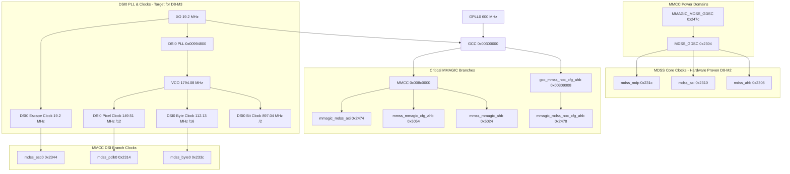

# XZS / MSM8996 DISPLAY CLOCK TREE AUDIT

## 1. Overview and Hierarchy

---

## 2. Clock Specifications & Target Frequencies

| Clock Name | MMCC Offset | Upstream Parent | Target Rate (Hz) | Purpose | Evidence Class |
|---|---|---|---:|---|---|
| `gcc_mmss_noc_cfg_ahb` | GCC `0x00309008` | GPLL0 | N/A | MMSS NoC interconnect config AHB | HARDWARE_PROVEN |
| `mmss_mmagic_ahb` | MMCC `0x5024` | `ahb_clk_src` (GPLL0) | N/A | MMAGIC AHB bus bridge clock | HARDWARE_PROVEN |
| `mmss_mmagic_cfg_ahb` | MMCC `0x5054` | `ahb_clk_src` (GPLL0) | N/A | MMAGIC config AHB clock | HARDWARE_PROVEN |
| `mmagic_mdss_noc_cfg_ahb`| MMCC `0x2478`| `gcc_mmss_noc` | N/A | MDSS NoC config bridge clock | HARDWARE_PROVEN |
| `mmagic_mdss_axi` | MMCC `0x2474` | `axi_clk_src` (XO) | N/A | MDSS MMAGIC AXI memory clock | HARDWARE_PROVEN |
| `mdss_ahb` | MMCC `0x2308` | `ahb_clk_src` (GPLL0) | N/A | MDSS register slave bus clock | HARDWARE_PROVEN |
| `mdss_axi` | MMCC `0x2310` | `axi_clk_src` (GPLL0) | N/A | MDSS master bus to system memory | HARDWARE_PROVEN |
| `mdss_mdp` | MMCC `0x231c` | `mdp_clk_src` (GPLL0) | N/A | MDP5 core pipeline processing clock | HARDWARE_PROVEN |
| `dsi0vco_clk` | DSI0 PLL `0x00994800` | XO (19.2 MHz) | 1,794,078,720 | 14nm DSI VCO core frequency | SOURCE_PROVEN |
| `dsi0pllbyte` | DSI0 PLL | `dsi0vco_clk` / 16 | 112,129,920 | DSI Byte Clock (8-bit serialized) | SOURCE_PROVEN |
| `dsi0pll` | DSI0 PLL | `dsi0vco_clk` / 12 | 149,506,560 | DSI Pixel Clock | SOURCE_PROVEN |
| `mdss_byte0` | MMCC `0x233c` | `dsi0pllbyte` | 112,129,920 | DSI0 byte clock branch | SOURCE_PROVEN |
| `mdss_pclk0` | MMCC `0x2314` | `dsi0pll` | 149,506,560 | DSI0 pixel clock branch | SOURCE_PROVEN |
| `mdss_esc0` | MMCC `0x2344` | XO (19.2 MHz) | 19,200,000 | DSI0 Low Power (LP) Escape clock | SOURCE_PROVEN |

---

## 3. Pixel & DSI Clock Formulas

From `somc,sharp_synaptics_cmd_9_panel`:
- Active Width = 1080 pixels
- H Front Porch = 56 pixels
- H Pulse Width = 8 pixels
- H Back Porch = 8 pixels
- **H Total** = 1080 + 56 + 8 + 8 = **1152 pixels**

- Active Height = 1920 lines
- V Front Porch = 227 lines
- V Pulse Width = 8 lines
- V Back Porch = 8 lines
- **V Total** = 1920 + 227 + 8 + 8 = **2163 lines**

- Refresh Rate = 60 Hz
- Bits Per Pixel (bpp) = 24 (RGB888)
- Active Lanes = 4

### Formulas:
$$\text{Pixel Clock} = H_{\text{total}} \times V_{\text{total}} \times \text{FPS} = 1152 \times 2163 \times 60 = 149,506,560\text{ Hz } (\approx 149.507\text{ MHz})$$

$$\text{DSI Bit Clock} = \frac{\text{Pixel Clock} \times \text{bpp}}{\text{Lanes}} = \frac{149,506,560 \times 24}{4} = 897,039,360\text{ Hz } (\approx 897.039\text{ MHz})$$

$$\text{DSI Byte Clock} = \frac{\text{DSI Bit Clock}}{8} = \frac{897,039,360}{8} = 112,129,920\text{ Hz } (\approx 112.130\text{ MHz})$$

$$\text{Target VCO} = 2 \times \text{DSI Bit Clock} = 2 \times 897,039,360 = 1,794,078,720\text{ Hz } (\approx 1.794\text{ GHz})$$

*(Note: Target VCO of 1.794 GHz falls within Qualcomm 14nm VCO valid range: [1.3 GHz, 2.6 GHz].)*
