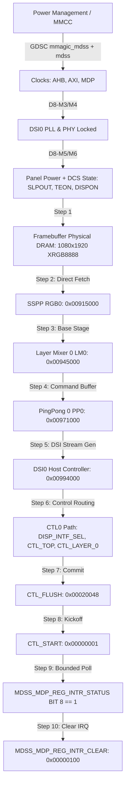

# D8-M8 Artifact: Hardware Dependency Graph & Routing Architecture

## Detailed Block Dependencies

1. **MDSS GDSC & Clocks**:
   - `mmagic_mdss_gdscr` (`0x008c5000`) & `mdss_gdscr` (`0x008c5004`): Provides core power domain.
   - `mdss_ahb_cbcr`, `mdss_axi_cbcr`, `mdss_mdp_cbcr`: Enables clock gating to MDP registers.
2. **SSPP RGB0 (`0x00915000`)**:
   - Fetches pixel data directly from physical DRAM without SMMU translation.
   - Feeds unscaled 1:1 1080x1920 frame to LM0.
3. **LM0 (`0x00945000`)**:
   - Blends inputs (here single RGB0 source on BASE layer).
   - Feeds output to PP0.
4. **PP0 (`0x00971000`)**:
   - Buffers scanout lines and synchronizes command transmission.
   - Raises `PP_0_DONE` interrupt bit (`BIT(8)`) when entire frame has been transferred.
5. **DSI0 Controller (`0x00994000`)**:
   - Formats pixel data into MIPI DCS Long Write packets (`0x39`) using opcodes `0x2C` (start) and `0x3C` (continue).
   - Drives 4 physical DSI data lanes + 1 clock lane in High-Speed mode.
6. **CTL0 (`0x00902000`)**:
   - Controls hardware pipeline synchronization and register latching on `CTL_START`.
